<!-- Animated Header with Gradient -->


<div align="center">

<!-- Holographic Typing Animation -->
<a href="https://git.io/typing-svg">
  
</a>

<!-- Animated Divider -->


<!-- Enhanced Animated Badges with Glow Effect -->
<p align="center">
  
  
  
  
</p>

<!-- Profile Stats -->
<p align="center">
  
  
  
</p>

<!-- Animated Line Break -->


<!-- Social Connect Section -->
<p align="center">
  <a href="mailto:email.om.dhage@gmail.com">
    
  </a>
  <a href="https://www.linkedin.com/in/om-dhage-03b784320">
    
  </a>
  <a href="tel:+919579612946">
    
  </a>
  <a href="https://github.com/omdhage">
    
  </a>
</p>


</div>

<br>

<!-- Animated Quote Banner -->
<div align="center">
  
</div>

<br>

<h2 align="center">
  
  
  About Me
  
  
</h2>

<div align="center">
  
<table>
<tr>
<td width="50%" valign="top">

### 🚀 Quick Overview

```yaml
name: Om Dhage
role: Full-Stack Developer & Freelancer
location: Nagpur, India 🇮🇳
education: BTech CSE Student 🎓
experience: 100+ Projects Completed ⭐
availability: Open for Freelance 💼
response_time: Within 24 hours ⚡

contact:
  email: email.om.dhage@gmail.com
  phone: +91 9579612946
  linkedin: om-dhage-03b784320
  
specialization:
  - Web Development (MERN Stack)
  - Backend Development (Java, Python)
  - AI/ML Solutions
  - UI/UX Design
  - RESTful APIs
```

</td>
<td width="50%" valign="top">

### 💻 Professional Code

```javascript
class OmDhage extends Developer {
  constructor() {
    super();
    this.name = "Om Dhage";
    this.passion = "Creating Digital Excellence";
    this.mission = "Solving real-world problems";
  }
  
  get skills() {
    return {
      expert: ["Java", "Python", "JavaScript"],
      frontend: ["React", "Tailwind", "Bootstrap"],
      backend: ["Node.js", "Flask", "Express"],
      database: ["MongoDB", "SQL"],
      ai_ml: ["NumPy", "Pandas", "Scikit-Learn"],
      tools: ["Git", "GitHub", "VS Code"]
    };
  }
  
  getCurrentFocus() {
    return [
      "🔥 Building scalable applications",
      "🧠 Mastering AI/ML technologies",
      "☁️ Learning cloud architecture",
      "🤝 Contributing to open source"
    ];
  }
  
  hireMeFor(project) {
    if (project.needsQuality && project.meetsDeadlines) {
      return "Let's build it together! 🚀";
    }
  }
}

const developer = new OmDhage();
console.log(developer.hireMeFor({ 
  needsQuality: true, 
  meetsDeadlines: true 
}));
```

</td>
</tr>
</table>

</div>


<h2 align="center">
  
  Tech Arsenal & Superpowers
  
</h2>

<div align="center">

<!-- Animated Tech Stack Cards -->
<table>
<tr>
<td valign="top" width="50%">

####  Frontend Development

<div align="center">  
  


</div>
</td>

<td valign="top" width="50%">

####  Backend Development

<div align="center">


</div>
</td>
</tr>

<tr>
<td valign="top" width="50%">

####  Database & Cloud

<div align="center">


</div>
</td>

<td valign="top" width="50%">

####  AI/ML & Data Science

<div align="center">


</div>
</td>
</tr>

<tr>
<td valign="top" width="50%">

####  Tools & Platforms

<div align="center">


</div>
</td>

<td valign="top" width="50%">

####  Currently Exploring

<div align="center">


</div>
</td>
</tr>
</table>

</div>


<h2 align="center">
  💡 What I'm Currently Up To
  
</h2>

<div align="center">

<table>
<tr>
<td width="50%" valign="top">

### 🎯 Current Focus

```python
class CurrentGoals:
    def __init__(self):
        self.working_on = [
            "🔥 Building AI-powered web apps",
            "💼 Delivering freelance projects",
            "📚 Learning System Design",
            "☁️ Exploring Cloud Services"
        ]
        
        self.learning = {
            "advanced": ["Microservices", "DevOps"],
            "cloud": ["AWS", "Docker", "Kubernetes"],
            "ai_ml": ["Deep Learning", "NLP"],
            "architecture": ["System Design", "Scalability"]
        }
        
        self.goals_2025 = [
            "✅ Master Cloud Architecture",
            "✅ Contribute to 100+ Open Source",
            "✅ Launch Personal SaaS Product",
            "✅ Build AI Solutions Portfolio"
        ]
    
    def availability(self):
        return {
            "freelance": "✅ Available",
            "collaboration": "✅ Open",
            "consultation": "✅ Free initial call",
            "response_time": "⚡ Within 24 hours"
        }

goals = CurrentGoals()
print(goals.availability())
```

</td>
<td width="50%" valign="top">

### 🔥 Development Workflow

```mermaid
graph LR
    A[💡 Idea] --> B[📋 Planning]
    B --> C[🎨 Design]
    C --> D[💻 Development]
    D --> E[🧪 Testing]
    E --> F[🚀 Deployment]
    F --> G[� Monitoring]
    G --> H[🔄 Optimization]
    
    style A fill:#ff6b6b
    style D fill:#00d9ff
    style F fill:#00ff00
```



### 📈 Expertise Level

```plaintext
Java            ████████████████████ 95%
Python          ██████████████████░░ 90%
JavaScript      ███████████████████░ 92%
React           ██████████████████░░ 88%
Node.js         ████████████████░░░░ 85%
SQL/NoSQL       ███████████████████░ 90%
AI/ML           ████████████████░░░░ 80%
Git/GitHub      ████████████████████ 95%
Problem Solving █████████████████████ 98%
```

### 💬 Ask Me About
`Web Development` `Java` `Python` `React` `Node.js` 
`MongoDB` `AI/ML` `Data Structures` `Algorithms` 
`System Design` `Cloud` `DevOps` `Freelancing`

</td>
</tr>
</table>

</div>


---

## 🎯 Coding Activity

<div align="center">

<!--START_SECTION:waka-->
<!--END_SECTION:waka-->

</div>

<h2 align="center">
  📫 Let's Connect & Collaborate!
  
</h2>

<div align="center">

<a href="mailto:email.om.dhage@gmail.com">
  
</a>
<a href="https://www.linkedin.com/in/om-dhage-03b784320">
  
</a>
<a href="tel:+919579612946">
  
</a>
<a href="https://github.com/omdhage">
  
</a>

<br><br>


</div>


<h2 align="center">
  💼 Freelance Services & Expertise
  
</h2>

<div align="center">

<table>
<tr>
  <td align="center" width="25%">
    
    <br><br>
    <strong>🌐 Web Development</strong>
    <br><br>
    <sub>React • Node.js • MongoDB</sub>
    <br><sub>Responsive & Modern UI</sub>
    <br><br>
    
  </td>
  <td align="center" width="25%">
    
    <br><br>
    <strong>⚙️ Backend Development</strong>
    <br><br>
    <sub>Java • Python • REST APIs</sub>
    <br><sub>Microservices Architecture</sub>
    <br><br>
    
  </td>
  <td align="center" width="25%">
    
    <br><br>
    <strong>🎨 UI/UX Design</strong>
    <br><br>
    <sub>Bootstrap • Tailwind CSS</sub>
    <br><sub>Modern & Responsive</sub>
    <br><br>
    
  </td>
  <td align="center" width="25%">
    
    <br><br>
    <strong>🤖 AI/ML Solutions</strong>
    <br><br>
    <sub>Python • NumPy • Pandas</sub>
    <br><sub>Data Science & Analysis</sub>
    <br><br>
    
  </td>
</tr>
</table>

<br>

### 🎯 Why Work With Me?

<table>
<tr>
<td align="center">⚡<br><strong>Fast Delivery</strong></td>
<td align="center">�<br><strong>Quality Code</strong></td>
<td align="center">🤝<br><strong>Great Communication</strong></td>
<td align="center">🔄<br><strong>Post-Launch Support</strong></td>
<td align="center">💰<br><strong>Competitive Pricing</strong></td>
</tr>
</table>

<br>


</div>


<h2 align="center">
  💭 Inspirational Dev Quote
  
</h2>

<div align="center">

[](https://github.com/piyushsuthar/github-readme-quotes)

<br>

### 🎯 Fun Facts About Me

<table>
<tr>
<td align="center">☕<br><sub>Coffee addict<br>10 cups/day</sub></td>
<td align="center">🌙<br><sub>Night coder<br>Best at 2 AM</sub></td>
<td align="center">🐛<br><sub>Debug master<br>console.log() FTW</sub></td>
<td align="center">🎧<br><sub>Code + Music<br>Perfect combo</sub></td>
<td align="center">📚<br><sub>Always learning<br>Never stopping</sub></td>
<td align="center">🚀<br><sub>Ship fast<br>Iterate faster</sub></td>
</tr>
</table>

</div>


<div align="center">

<h2>
  
  Let's Build Something Amazing Together!
  
</h2>

<p>⭐ If you find my projects interesting, consider giving them a star!</p>
<p>🔔 Follow me for more amazing content and open-source contributions!</p>
<p>💬 Feel free to reach out for collaborations or just a friendly tech chat!</p>

<br>

<!-- Animated Closing Message -->


<br><br>

<!-- Stats and Motto -->
<table>
<tr>
<td align="center" width="33%">
  
  <br><br>
  <strong>🎨 Creative</strong>
  <br><sub>Innovative Solutions</sub>
</td>
<td align="center" width="34%">
  <h3>🚀 Made by Om Dhage</h3>
  <p><em>"Transforming ideas into elegant code,<br>one commit at a time!"</em></p>
  <br>
  
  <br><br>
  <strong>💬 "First, solve the problem. Then, write the code."</strong>
  <br><sub>- John Johnson</sub>
</td>
<td align="center" width="33%">
  
  <br><br>
  <strong>⚡ Efficient</strong>
  <br><sub>Optimized Performance</sub>
</td>
</tr>
</table>

<br>

<!-- Tech Journey Timeline -->
<details>
<summary><b>🎯 My Tech Journey (Click to expand)</b></summary>
<br>


</details>

<br>

<!-- Quick Links -->
### 🔗 Quick Links

<a href="#-about-me">👤 About</a> •
<a href="#-tech-arsenal--superpowers">💻 Skills</a> •
<a href="#-freelance-services--expertise">💼 Services</a> •
<a href="mailto:email.om.dhage@gmail.com">📧 Contact</a> •
<a href="https://www.linkedin.com/in/om-dhage-03b784320">🔗 LinkedIn</a>

<br>

<!-- Footer Wave Animation -->


</div>
